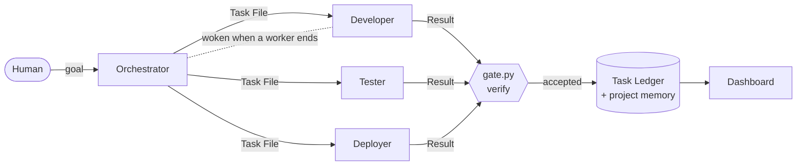

# AgentFlow

**A team of AI coding agents with shared project memory.**
Run one software project with several AI sessions (Claude Code, Codex CLI, Antigravity) without losing state or overwriting each other's work.

  

## The problem

Every new AI session forgets the project. Two sessions on one repository break each other's work.
AgentFlow gives them one memory, clear roles, and one rule: **nothing is accepted without evidence.**

## How it works

## What is inside

| | |
|---|---|
| **Project memory** | `docs/state/`: handoff, decisions, session log, known issues. One protocol, [`protocol.md`](.agentflow/protocol.md), is the single source of rules. |
| **Four roles** | The Orchestrator plans and accepts; Developer, Tester, and Deployer work one task each in a fresh session. |
| **Tasks by template** | A Task File says what, where, which files, which tool, model, and effort. The launch is refused if it is incomplete. |
| **Several CLIs** | Claude Code, Codex CLI, Antigravity CLI; the Orchestrator routes by strength, remaining limit, and cost. Model tiers `small / standard / strong` in `models.json`. |
| **Wake-up** | `run-task.ps1 -Wait` runs in the background at zero token cost and wakes the Orchestrator when a worker finishes. |
| **Product definition** | Vision, Brief, PRD, Architecture templates with gates G0-G5. A task cites requirement IDs; unapproved requirements block the launch. |
| **Dashboard** | Read-only, Russian interface: task table with filters, Gantt, Kanban by status, timeline, links between tasks. |
| **The human's queue** | Questions for the owner go to `docs/state/owner-tasks.md`; work does not wait, except for keys, money, production, and irreversible steps. |

## Why you can trust the result

- **Accepted only on evidence:** `gate.py verify` must pass, and the ledger moves only along allowed transitions.
- **Independent Tester** in a disposable checkout, preferably on another model.
- **Risk scale** `low / risky / critical`: for risky tasks the Tester proves the tests fail without the change; critical ones need an acceptance test written separately.
- **Production only with the human's yes**, given in the Deployer session.
- The template was audited file by file against FPF (see Credits) and has regression checks of its tools: `python dev/test_gate_spec.py`.

## Start

1. In Claude Code, inside your project, say **"внедри AgentFlow"** (skill `integrate-agentflow`). In another tool: "follow `<AgentFlow>/.agentflow/install.md` for this project".
2. Start the Orchestrator: `/start-role orchestrator` and your goal. A session without a role uses `/start-session`.
3. Watch progress: `python .agentflow/dashboard/serve.py`.

Daily use: [GUIDE.md](.agentflow/guide/GUIDE.md) (Russian). What changed in each version: [CHANGELOG](.agentflow/CHANGELOG.md).
Requires git, Python 3, PowerShell 7 on Windows, and the CLIs of the tools you use.

Layout of a project

| Path | Owner | What |
|---|---|---|
| `.agentflow/` | template | the AgentFlow machine, the same in every project; an update replaces it as a whole |
| `AGENTS.md`, `CLAUDE.md`, `.gitignore` | project | AgentFlow owns only its block between `agentflow:start` and `agentflow:end` |
| `.claude/commands/` | template | the five AgentFlow slash commands |
| `docs/` | project | the project's knowledge in one flow: `product/` -> `plan.md` -> `tasks/` -> `state/` -> `runbook/`; an update never touches it |

Inside `.agentflow/`:

| Path | What |
|---|---|
| `protocol.md` | the protocol: terms, states, rules, session steps |
| `install.md` | install, update, migrate from 2.x: the procedure an LLM session follows |
| `roles/` | one instruction file per role; `tool-routing.md`: which tool takes which task |
| `tools/` | `run-task.ps1` launcher, `gate.py` preflight / verify / Stage check, `ledger.py` Task Ledger, `models.json` model tiers |
| `templates/` | skeletons copied into `docs/` once: Task File, product documents, owner tasks |
| `guide/` | for the human (Russian): `GUIDE.md` (install, daily use) and the product explanations |
| `dashboard/` | read-only view for the human: task table, filters, Gantt, Kanban by status, timeline (`python .agentflow/dashboard/build.py`) |
| `CHANGELOG.md` | what changed in each version, with migration notes |

This repository mirrors a project: its own `docs/` is the template's memory, and `dev/` holds regression checks of the tools; neither is copied into projects.

## Credits

Audited against the **First Principles Framework (FPF)** by **Anatoly Levenchuk**: [github.com/ailev/FPF](https://github.com/ailev/FPF) (CC BY 4.0).

## License

MIT © Aleksandr Pankin
