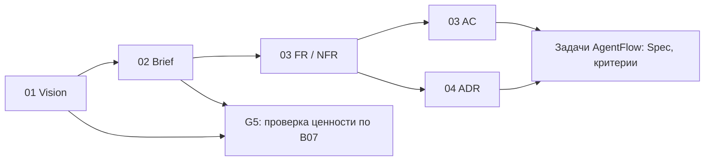

# Определение продукта

> Входная точка продукта для человека и оркестратора. Норма процесса — `docs/ai-handoff-protocol.md`, разделы «Product definition» и «Owner tasks». Пояснения для человека — файлы 05–08.

**Продукт:** [вписать]
**Владелец:** [вписать]
**Репозиторий:** [вписать]

## Документы продукта

| Файл | Главный вопрос | Статус ведётся |
|---|---|---|
| [01 Vision](01_VISION.md) | Зачем существует продукт и каким должен стать? | на весь документ |
| [02 Brief](02_BRIEF.md) | Для кого, что в MVP, в каких границах? | на весь документ |
| [03 PRD](03_PRD.md) | Как ведёт себя система и как принять результат? | на каждый FR, NFR |
| [04 Architecture](04_ARCHITECTURE.md) | Каким техническим способом это сделать? | на каждый ADR |
| `decisions/ADR-###.md` | Существенные технические решения | на каждый ADR |
| [09 Обзор готовности](09_REVIEW.md) | Что проверено, чего не хватает, что упрощено? | отчёт агента, каждый раунд |

Черновики пишет AI со слов владельца и по исследованию. Финальное слово владельца — задачи в `state/owner-tasks.md`; работа его не ждёт, кроме случаев из списка блокирующего ([06](06_AUTHORITY.md)).

## Пояснения для человека

Агенты читают их только по прямому запросу.

| Файл | О чём |
|---|---|
| [05 Гейты](05_GATES.md) | G0–G5: что проверяют агенты, где слово владельца |
| [06 Полномочия](06_AUTHORITY.md) | кто что решает, что блокирует работу, задачи на владельца, выкладка |
| [07 Правила документов](07_DOCUMENT_RULES.md) | формат, ID, статусы, ссылки, Change Impact |
| [08 Пример трассировки](08_TRACEABILITY_EXAMPLE.md) | цепочка от Vision до задачи на условном продукте |

## Один факт — одно место

- **Vision:** причина запуска, North Star, ценность, принципы, долгосрочные запреты.
- **Brief:** пользователи и сценарии, состав MVP, исключения, ограничения, метрики MVP.
- **PRD:** наблюдаемое поведение (FR), качество (NFR), приёмка (AC).
- **Architecture:** компоненты, данные, API, технологии; решения — в ADR.

Нижестоящий документ ссылается на ID вышестоящего и не пересказывает его. Расхождение — вопрос `Q-*`, а не молчаливая правка.

## Связи

## Статусы

`DRAFT → PROPOSED → APPROVED`; `STALE` — источник изменился, нужна перепроверка; `SUPERSEDED` — заменён. Реализовывать можно `PROPOSED` и `APPROVED`. Подробно — [07](07_DOCUMENT_RULES.md#статусы).

## Реестр гейтов

Единственное место записи гейтов. Срез = Stage из `docs/project-plan.md`. Ответ владельца хранится в журнале `state/owner-tasks.md`; здесь — ссылка на задачу и итог.

| Gate | Stage | Версии документов | Проверка агентом | Слово владельца |
|---|---|---|---|---|
| G0–G3 | [N] | [01 x.y.z, 02 x.y.z, 03 x.y.z, 04 x.y.z] | [дата, 09_REVIEW vX.Y.Z] | [OWN-### → ждёт / APPROVED дата / изменения дата] |
| G4 | [N] | — | [дата, `gate.py stage N`] | — |
| G5 | [N] | — | [дата, данные по B07] | [OWN-### → ждёт / ок дата / не ок дата] |
