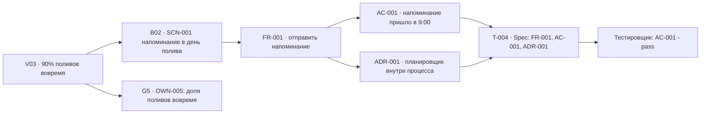

# 08 · Пример трассировки: от Vision до задачи

> Пояснение для человека на условном продукте. Это **не требования** вашего продукта: ID ниже демонстрационные, переносить их нельзя. Агенты читают этот файл только по прямому запросу. Файл принадлежит шаблону и заменяется при обновлении AgentFlow.

Условный продукт: бот, который напоминает о поливе комнатных растений.



Две ветви идут от FR: приёмка (AC → критерии задачи → проверка) и устройство (ADR → задача). ADR не стоит «после» AC.

| ID | Где | Смысл |
|---|---|---|
| `V03` | 01 Vision | North Star: 90% поливов вовремя за 3 месяца |
| `SCN-001` | 02 Brief, B02 | Когда наступает день полива, владелец растения хочет получить напоминание, чтобы полить вовремя |
| `FR-001` | 03 PRD | При наступлении дня полива система отправляет владельцу напоминание. `Статус: PROPOSED`, `Source: B04 / UC-001`, `Must` |
| `AC-001` | 03 PRD | `Source: FR-001`. Given растение с поливом раз в 3 дня, When наступил третий день, Then в 9:00 по времени владельца пришло одно сообщение |
| `ADR-001` | 04, `decisions/` | Планировщик внутри процесса бота, без внешней очереди: один процесс, `B06` |
| `T-004` | `tasks/` | Задача разработчика, ссылается на FR, AC, ADR |
| `OWN-005` | `state/owner-tasks.md` | Владелец через месяц смотрит долю поливов вовремя |

## Как это выглядит в задаче

```markdown
Role: developer
Stage: 2
Spec: FR-001, AC-001, ADR-001

## Read first
- docs/product/03_PRD.md - FR-001, AC-001
- docs/product/decisions/ADR-001.md

## Acceptance criteria
- [ ] AC-001: напоминание уходит в 9:00 по часовому поясу владельца, одно на день полива
```

Задача ссылается на ID и не пересказывает требование. Исполнитель читает только названные разделы. `tools/gate.py` не запустит задачу, если `FR-001` в статусе `DRAFT` или `STALE`.

## Две проверки

| Проверка | Вопрос | Опора | Кто |
|---|---|---|---|
| **Верификация** (G4) | Сделано ли то, что записано? | FR, NFR, AC, проверки задач | агенты: `gate.py verify`, тестировщик |
| **Валидация** (G5) | Решает ли продукт задачу пользователя? | `B07`, `V03` | владелец, задача `OWN` |

Зелёные тесты не доказывают, что создан нужный продукт: это показывает только G5.

[← К оглавлению](00_INDEX.md)
